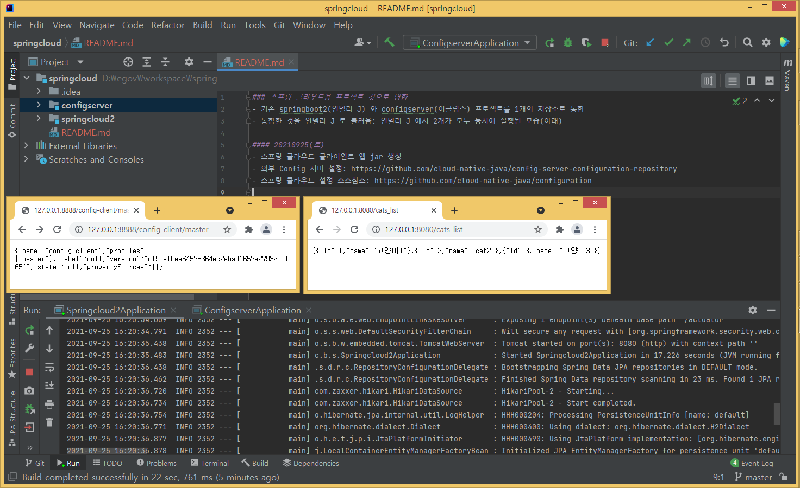
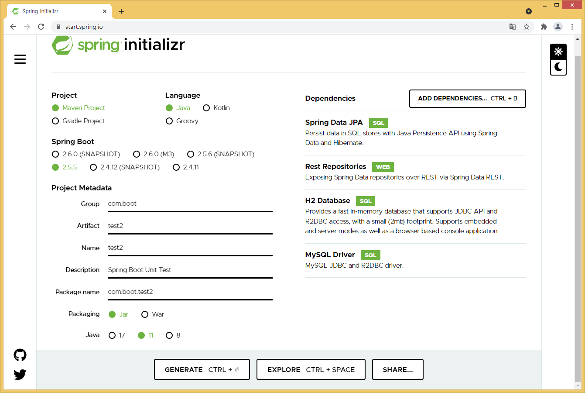
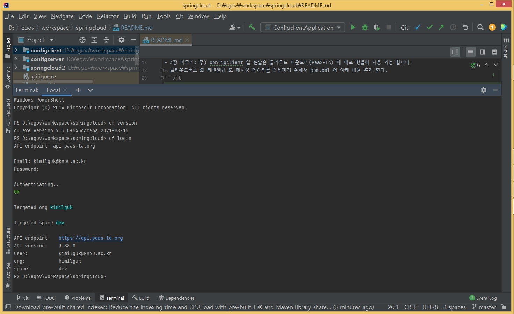
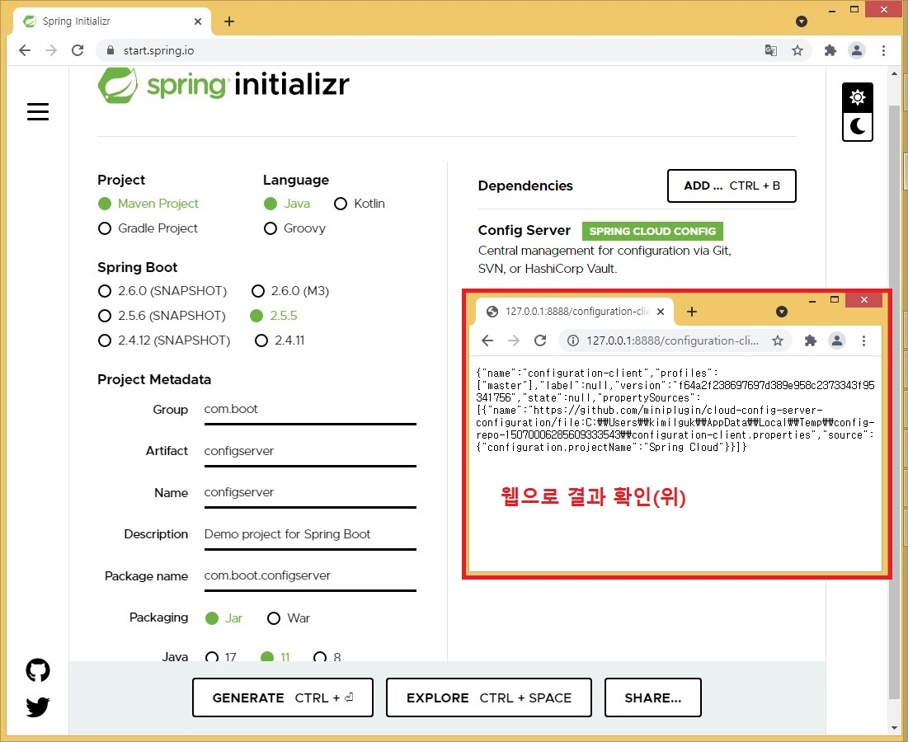
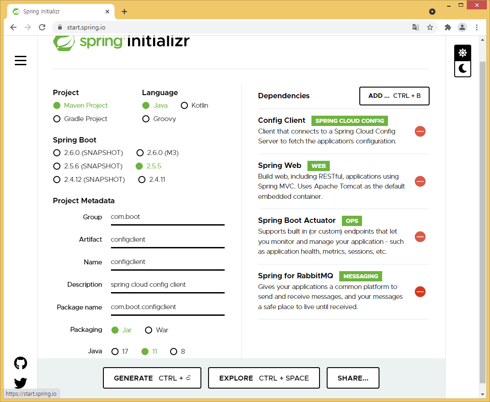

### 스프링 클라우드용 프로젝트 여러개를 1개의 깃으로 병합
- 모든 SpringBoot1.x 작업을 SpringBoot2.5.x 로 마이그레이션
- 모든 JUnit4 테스트를 JUnit5 용으로 마이그레이션
- 기존 springboot2(인텔리 J) 와 configserver(이클립스) 프로젝트를 1개의 저장소로 통합
- 통합한 것을 인텔리 J 로 불러옴: 인텔리 J 에서 2개가 모두 동시에 실행된 모습(아래)
  
- git submodule add https://github.com/miniplugin/cloud-config-server-configuration.git
- 위 명령으로 현재 깃 저장소에 클라우드용 설정 내용 가져오기처리
- 주) 위 가져온 깃 내용은 확인용으로 직접 수정은 않됨, 수정하려면, 위 외부 깃 주소내용을 수정해야 함
- 외부 작업결과는 Git 메뉴의 Update Project 클릭하면 적용 됨.
- 스프링 이니셜라이즈로 스프링부트 생성 후 인텔리 J 로 불러와서 pom.xml 파일 우클릭 > add Maven Project 선택하면 실행가능하게 변함.
- JUnit4 에서 @RunWith(SpringRunner.class) 사용한 애노테이션이 JUnit5 에서는 팰요 없음.

#### 20211007(목): test2/com.boot.test2/account/AccountRepositoryTest.java
- @DataJpaTest 사용:
- AccountNumber 클래스는 숫자 널체크 및 개수 제한 조건을 줄수 있다.(아래)
```java
public AccountNumber(String accountNumber) {
        Assert.notNull(accountNumber, "Account Number 공백일 수 없습니다.");
        Assert.isTrue(accountNumber.length() == 9,
                "Account Number 는 반드시 9자 이어야 합니다.");
        this.accountNumber = accountNumber;
    }
```
- 참고로, @DataJpaTest 를 사용하지 않는 스프링5 레커시에서는 Account.java 클래스에 아래처럼 널체크를 한다.
```java
@NotNull(message="빈값으로 저장할 수 없습니다.")
private String accountNumber;
```

#### 20211004(월): test2/com.boot.test2/account/AccountControllerTest.java, AccountService.java
- @WebMvcTest 사용: MVC 컨트롤러 테스트 전용 애노테이션 인터페이스

#### 20211003(일): test2/com.boot.test2/users/UsersTests.java
- JUnit5 단위 테스트(주피터사용): @JsonTest 사용 

#### 20210930(목): test2/test/Test2ApplicationTests.java
- 스프링 부트 기본정보 기술참조: https://kok202.tistory.com/131
- 4장 테스트 소스 참조: https://github.com/cloud-native-java/testing/tree/master/testing-basics/account-service
- com.boot.test2 스프링부트2 프로젝트 생성:
  
- 스프링 톰합테스트: @SpringBootTest 사용(스프링부트2, 내장된 JUnit5)

#### 20210928(화)
- 스프링부트2 버전에서 JUnit5 용으로 단위 테스트를 실시 한다.
- JUnit5 기술참조: https://sas-study.tistory.com/316

#### 20210927(월)
- 클라우드 파운드리 cli 설치: https://github.com/cloudfoundry/cli#downloads
- V7 윈도우용 설치: https://github.com/cloudfoundry/cli/wiki/V7-CLI-Installation-Guide
  
- cf login (endpoint: api.paas-ta.org
- cf push configserver -b java_buildpack
- 디버그: cf logs configserver --recent
- cf buildepacks 로 사용가능한 빌드 팩 버전 확인
- cf apps 로 현재 등록된 앱 확인
- cf delete configserver
- cf login --skip-ssl-validation
- 파스타에 스프링 클라우드 프로젝트 배포 실패: configserver, springcloud2 모두
- 자바 8에서 11로 마이그레이션시 아래 내용 추가해야 함.
```xml
env:
      JBP_CONFIG_OPEN_JDK_JRE: '{ "jre": { version: 11.+ } }'
```

#### 20210926(일)
- @RefreshScope 붙은 클래스 객체는 실행시 설정서버 정보를 항상 새로 불러 들인다.
- RefreshCounter 로 위 @RefreshScope 가 붙은 ProjectNameRestController 스프링 빈의 리프레시를 확인
- 3장 마무리: 주) configclient 앱 실습은 클라우드 파운드리(PaaS-TA) 에 배포 했을때 사용 가능 합니다.
- 클라우드버스 와 래빗엠큐 로 메시징 데이터를 전달하기 위해서 pom.xml 에 아래 내용 추가 한다.
```xml
<dependency>
    <groupId>org.springframework.cloud</groupId>
    <artifactId>spring-cloud-bus</artifactId>
</dependency>
```

#### 20210925(토)
- 액츄에이터 메이븐 라이브러리: https://mvnrepository.com/artifact/org.springframework.boot/spring-boot-starter-actuator
- Config 서버 프로젝트 추가(아래)
  
- 결과 확인: http://127.0.0.1:8888/configuration-client/master
- 스프링 클라우드 클라이언트 앱 jar 생성(이클립스일때, 인텔리 J 일때는 바로 실행 가능)
- 외부 Config 서버 설정: https://github.com/cloud-native-java/config-server-configuration-repository
- 스프링 클라우드 설정 소스참조: https://github.com/cloud-native-java/configuration
- Config 클라이언트 프로젝트 추가(아래): 아직 PaaS 에 배포하지 않아서 vcap.service 르 configserver 값을 import 할 수 없음.
- 참고: VCAP(VMWare Cloud Application Platform) 은 클라우드 파운드리(CF) 의 플래폼을 말합니다.
  
