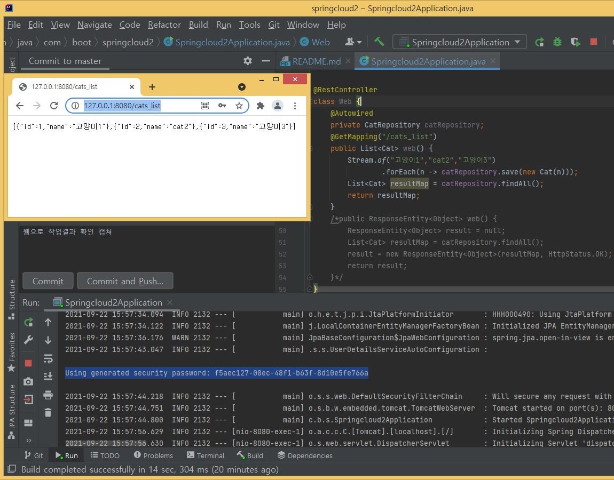

### 스프링 클라우드 사용
- 기술참조: 클라우드 네이티브 자바 책 참조
- 위 책에서 사용한 피보탈 클라우드는 더이상 서비스 되지 않고 사라졌습니다.ㅜㅜ(아래)
- 주) 피보탈 웹서비스는 2021년 1월 이후 Tanzu라는 이름으로 변경 된 후 더이상 사용되지 않습니다.
- https://tanzu.vmware.com/content/pivotal-web-services-blog/pivotal-web-services-end-of-availability-announcement-and-timeline
- 그래서, 우라나라서 제공하는 Paas 서비스인 파스타에서(cf 명령사용가능) 무료체험을 사용하도록 합니다.( https://paas-ta.kr/ ) 
- 스프링 클라우드란? (DevOps: 개발후 클라우드로 운영)
- 앱관련 설정을 자동으로 처리해서 개발자가 비지니스 로직에 집중하도록 한 스프링 부트로 구현한다.
- 개발 중간 수시로 운영환경에 배포해서(CI) 고객의 피드백을 유도하게 됨. 수시로 디버그 하게 되면, 수정및 재배포에 드는 노력이 줄어듬
- 아마존웹 서비스(AWS), 파스타(Paas-TA), 구글 클라우드 플랫폼(GCP), 헤로쿠 클라우드, 피보탈 클라우드 파운드리(CF) 중에서
- 클라우드 파운드리 운영환경에 스프링 부트 프로젝트를 클라우드용으로 변환한 작업을 자동화한 결과를 스프링 클라우드 라고 한다.
- CF는 IaaS처럼 하드디스크,램,CPU,리눅스 OS,보안업데이트 에 개발자가 집중하지 않는다.
- CF는 CaaS처럼 컨테이너에 집증하지 않고, PaaS 형태(필요한 만큼 자원을 할당=자동프로비저닝)로 사용한다.

#### 20210925(토)
- 스프링 클라우드 클라이언트 앱 jar 생성
- 외부 Config 서버 설정: https://github.com/cloud-native-java/config-server-configuration-repository
- 스프링 클라우드 설정 소스참조: https://github.com/cloud-native-java/configuration

#### 20210924(금)
- dev 개발환경, prod 운영환경 별 properties 파일 구분하기
- yaml 파일은 jar 실행시 적용: java -jar myapp.jar --spring.profiles.active=prod
- 기술참조1: https://1minute-before6pm.tistory.com/12
- 기술참조2: https://goddaehee.tistory.com/213
- 액츄에이터 메이븐 라이브러리: https://mvnrepository.com/artifact/org.springframework.boot/spring-boot-starter-actuator
- 스프링 클라우드의 설정 서버: PaaS 에서 스프링 클라우드 설정 서버 기반의 Config Server 서비스를 제공하고 있다.
  

#### 20210923(목)
- 환경설정 을 xml 이 아닌 자바방식으로 사용할때 외부 property 변수를 사용하는 방법
- Environment 와 @Value 인터페이스를 사용.

#### 20210922(수)
- 스프링 데이터 JPA 사용 결과: 레포지토리 인터페이스 사용 @RepositoryRestResource
- Rest API 간단한 결과 출력: @RestController 사용 결과(아래 http://127.0.0.1:8080/cats_list )
- 스프링 시큐리티 적용되었기 때문에 기본 id(user) / 암호 필요(아래 Using generated security password 부분)
  

#### 20210920(월)
- springboot2 메이븐 프로젝트 생성. https://start.spring.io/ (스프링 initialize 사용)
- 깃 레포지토리 생성 및 연동.
- OpenJDK 11 다운로드: https://jdk.java.net/archive (아래)
  
- 스프링 initialize 사용: 나중에 pom.xml 에 롬복 의존성 플러그인 추가(아래)
  
- Springcloud2Application.java 에 엔티티와 Jpa 레포지토리 인터페이스 생성
- 이클립스에서 깃 생성하지 않고, CLI 로 생성시참고(아래)

```
//명령줄에서 새 저장소 만들기(아래)
echo "# springcloud2" >> README.md
git init
git add README.md
git commit -m "first commit"
git branch -M master
git remote add origin https://github.com/miniplugin/springcloud2.git
git push -u origin master
//명령줄에서 기존 저장소 푸시(아래)
git remote add origin https://github.com/miniplugin/springcloud2.git
git branch -M master
git push -u origin master
//다른 저장소에서 코드 가져오기(아래)
git clone https://github.com/miniplugin/springcloud2.git
```
- 깃 신규 보안정책으로 이클립스에서 푸시에 사용하는 암호를 토큰으로 변경하는 것이 귀찮아서 인텔리J 로 변경해서 작업
- JUnit 테스트 작업 기술참조: https://velog.io/@dnjscksdn98/JUnit-Mockito-Using-MockMvc-to-test-Controllers
- JUnit 에서 한글 출력 처리: https://stackoverflow.com/questions/58525387/mockmvc-no-longer-handles-utf-8-characters-with-spring-boot-2-2-0-release
- JUnit 작업 결과 확인(아래)
  